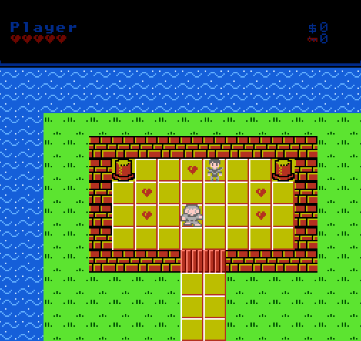

# Dino Epoch

A game I created in 3 days using amazing tools and standing on the shoulder of giants.
I've always wanted to create games ever since I was young and the retro nostalgia really
spoke to me. So I wanted to see how quickly I could put together a game, and here is the result!
It's not perfect, but I've run out of time... for now. I might eventually update this. 

**Current game version:** 1.0.0

# Information

The game plays similar to the Legend of Zelda or a traditional retro Action RPG. I followed the tutorials in the start kit initially, then
I implemented several features of my own. There's a princess to save, and swords, shields, dragons & puzzles waiting for you-- so check it out!

The game is pretty decent at telling you what you need to know, although some of it is left unsaid and requires exploration, just like the old
games did. 

# Credits

## Tools

[cc65](https://www.cc65.org/) By [Ullrich von Bassewitz](https://www.von-bassewitz.de/uz/)

[NESLib](http://shiru.untergrund.net/code.shtml) by [Shiru](http://shiru.untergrund.net/)

[create-nes-game](https://create-nes-game.nes.science)

[NES Screen Tool](http://shiru.untergrund.net/software.shtml) by [Shiru](https://shiru.untergrund.net/)

[NEXXT](https://frankengraphics.itch.io/nexxt) by [FrankenGraphics](https://frankengraphics.wordpress.com/)

[NES Space Checker (nessc)](http://shiru.untergrund.net/software.shtml) by [Shiru](http://shiru.untergrund.net/)

[Famitracker](http://famitracker.com/) by jsr

[FCEUX](http://www.fceux.com/web/home.html) 

[Tiled](http://www.mapeditor.org/) by [Thorbjørn Lindeijer](https://github.com/bjorn)

